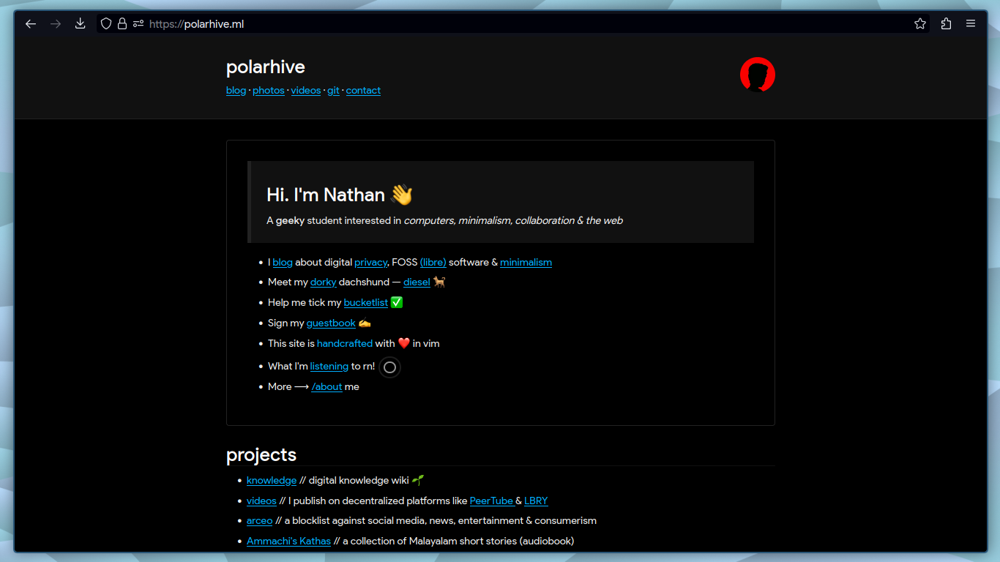

# Vulpes 🦊

``` text
> Minimal Firefox user.js tweaked for privacy
```



Firefox is a [mess](https://polarhive.net/blog/firefox/). This
repository contains my configs & tweaks that you can use on
Firefox-based browsers. I think Mozilla should ship with these
tweaks pre-configured.

## Like LibreWolf?

Vanilla Firefox can be tweaked to do everything that [LibreWolf](https://librewolf.net/)
already does. You don't need to use LibreWolf if you use my ``user.js`` file.

Most GNU/Linux distros ship with better; up-to-date versions of Firefox.
LibreWolf is built only after Mozilla releases the next build of
Firefox. Some-distros specifically patch their distro's release to
improve performance and have desktop [integrations](https://gitlab.com/librewolf-community/browser/linux/-/issues/232)
like KDE Plasma.

Most importantly — you get official support from Mozilla, should
top-sites stop working because of [Chromium](https://webcompat.com/)
incompatibilities. LibreWolf might feel too-harsh for some people when
popular sites stop-working. You should be using the [Tor Browser](https://www.torproject.org/)
if your goal is to improve your digital-privacy and combat fingerpriting.

## What's with the name?

``` text
vulpes — family of foxes; this user.js can be used with any Firefox based browser
```

## Tweaks 🛠

- Firefox Accounts: disabled
- Geolocation: disabled
- Google Safe Browsing: disabled
- Notifications: disabled
- Pocket: disabled
- Telemetry: disabled

---
# Instructions

1. Click [here](https://codeberg.org/polarhive/vulpes/archive/main.zip) to download the latest ``user.js`` file
2. Extract the zip file
3. Copy the ``user.js`` file
4. Launch Firefox
5. Type ``about:profiles`` in the address bar and hit enter
6. Navigate to the Firefox current profile folder by clicking on ``Open Directory``
7. Paste the ``user.js`` file here
8. Re-launch Firefox
9. Search Engine: Google, Bing, Yahoo are not good choices. Pick another search engine
10. Try [DuckDuckGo](https://duckduckgo.com/), [Whoogle](https://github.com/benbusby/whoogle-search), [Brave Search](https://search.brave.com/), or pick a [Searx](https://searx.me/) instance.

> TIP: Right-click on the address bar to add custom search-engines when visiting the site

## Extensions & Themes

I use these for a better web-browsing experience. I'd say installing
uBlock origin is the least one can do these days. Checkout the other
extensions or install your own. Make sure your extensions aren't
proprietary, as they are potenial security-risks.

- [uBlock Origin](https://addons.mozilla.org/en-US/firefox/addon/ublock-origin): ad/content blocker
- [LocalCDN](https://addons.mozilla.org/en-US/firefox/addon/localcdn-fork-of-decentraleyes): fetch fonts, JS libraries locally instead of remote CDNs
- [libredirect](https://addons.mozilla.org/en-US/firefox/addon/libredirect): helps you use privacy frontends like Nitter, Piped & Teddit
- [Dark Reader](https://addons.mozilla.org/en-US/firefox/addon/darkreader): dark-mode for sites that don't have a dark theme
- [nicedark-theme](https://addons.mozilla.org/en-US/firefox/addon/nicedarktheme): what it says on the tin: a 'really nice' dark-theme
- [materialocean-theme](https://addons.mozilla.org/en-US/firefox/addon/material-ocean-theme): the colorscheme that I use

> TIP: HTTPS is always on. You don't need to install any extension. Check this [feed](https://github.com/polarhive/vulpes/commits/main.atom) for furthur updates.

---
This repo is hosted on [Codeberg](https://polarhive.net/vulpes) & mirrored to [GitHub](https://polarhive.net/github) for traffic.

[](https://www.gnu.org/licenses/gpl-3.0.txt)

